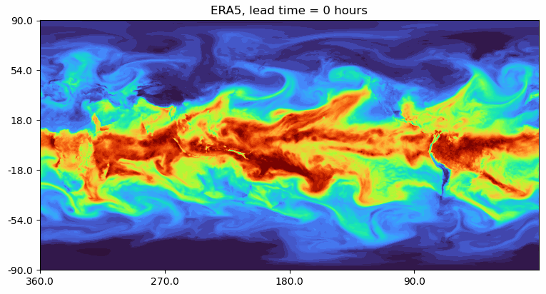
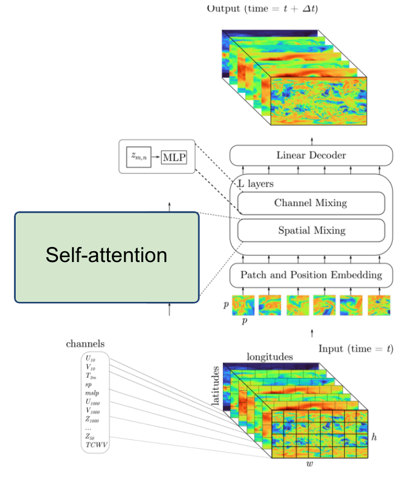
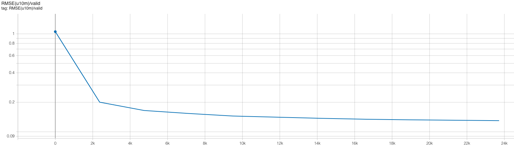
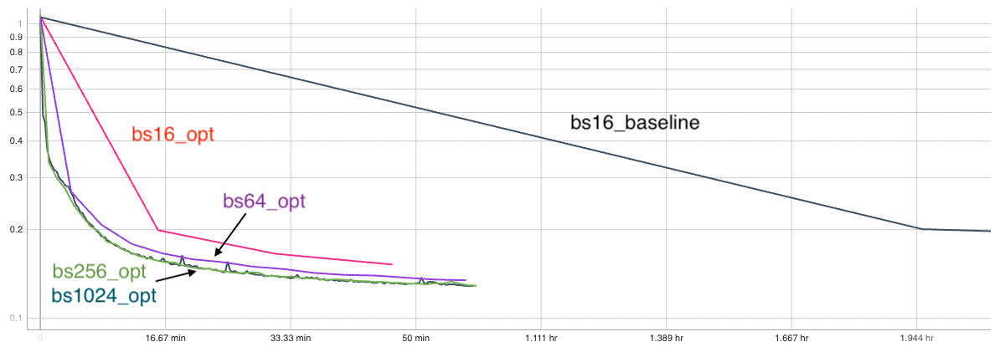
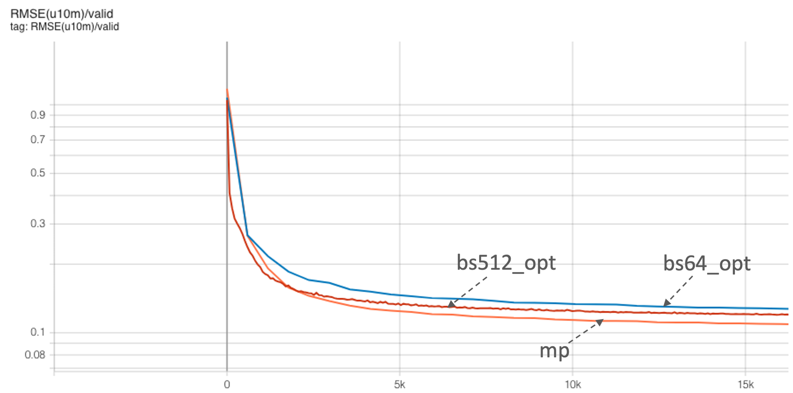
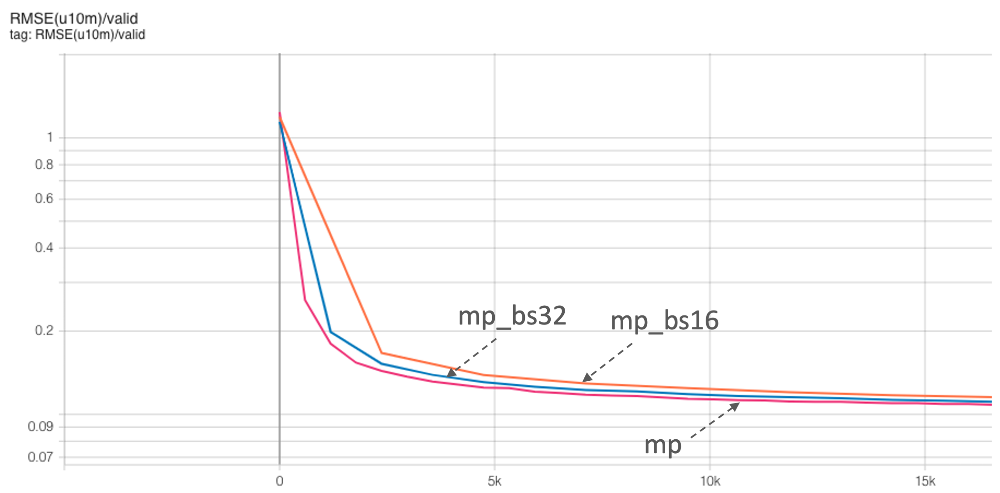

# DL4SCI25: Deep Learning at Scale at NERSC

This repository contains the example code material for the hands-on event:
*Deep Learning at Scale* at the DL4SCI 2025 school

**Contents**
* [Links](#links)
* [Installation](#installation-and-setup)
* [Model, data, and code overview](#model-data-and-training-code-overview)
* [Single GPU training](#single-gpu-training)
* [Single GPU quick performance tips](#single-gpu-quick-optimization-tips)
* [Distributed training with data parallelism](#distributed-training-with-data-parallelism)
* [Multi-GPU model parallelism](#model-parallelism)

## Links

Slides: https://drive.google.com/file/d/1NEwNHtkOiEFzQENODEFEZk9jam9uP5a1/view?usp=sharing

NERSC JupyterHub: https://jupyter.nersc.gov

Data download (only needed if you want to run our examples elsewhere): https://portal.nersc.gov/project/dasrepo/pharring/sc23_data

## Installation and Setup

### Software environment

The instructions in this README are intended to be used with NERSC's Perlmutter machine.

Access to the Perlmutter machine is provided for this tutorial via [jupyter.nersc.gov](https://jupyter.nersc.gov).
You can log in to Jupyter via the link using your NERSC credentials.
Alternatively, you can use your terminal and ssh into Perlmutter.
Once logged into the hub, start a session by clicking the button for Perlmutter Login Node (other options will not work with this tutorial material).
This will open up a session on a Perlmutter login node, from which you can submit jobs to the GPU nodes and monitor their progress.

To begin, start a terminal (from JupyterHub or ssh into Perlmutter) and clone this repository with:
```bash
git clone https://github.com/NERSC/dl4sci25-dl-at-scale.git
```
You can use the Jupyter file browser to view and edit source files and scripts. For all of the example commands provided below, make sure you are running them from within the top-level folder of the repository. In your terminal, change to the directory with
```bash
cd dl4sci25-dl-at-scale
```

For running slurm jobs on Perlmutter, we will use training accounts which are provided under the `trn011` project. The slurm script `submit_singlegpu.sh` included in the repository is configured to work automatically as is, but if you submit your own custom jobs via `salloc` or `sbatch` you must include the following flags for slurm:
* `-A trn011` is required for training accounts
* `--reservation=dl4sci` is required to access the set of GPU nodes we have reserved for the duration of the training. 

The code can be run using the `nersc/pytorch:24.08.01` docker container. On Perlmutter, docker containers are run via
[shifter](https://docs.nersc.gov/development/shifter/), and this container is already downloaded and automatically invoked by our job submission
scripts. Our container is based on the [NVIDIA NGC 24.08 pytorch container](https://docs.nvidia.com/deeplearning/frameworks/pytorch-release-notes/rel-24-08.html), with a few additional packages added.


## Model, data, and training code overview

The model in this repository is adapted from modern applications of deep learning for weather forecasting, e.g. [FourCastNet](https://arxiv.org/abs/2202.11214), [GraphCast](https://arxiv.org/abs/2212.12794), [Pangu-Weather](https://arxiv.org/abs/2211.02556), and others. These models are trained on a combination of observed and simulated data describing the atmospheric state on Earth over the past several decades, and they achieve impressive performance in terms of accuracy and forecast speed when compared against traditional numerical weather prediction (NWP) models.



For these examples we will be using a [vision transformer](https://arxiv.org/abs/2010.11929) (ViT) architecture, for which our implementation can be found in [`networks/vit.py`](networks/vit.py). ViTs are a widely-used architecture in computer vision, known for scaling well to large datasets and being able to model long-range dependencies easily via the use of self-attention layers. While 'vanilla' ViTs are not necessarily state-of-the-art on the weather forecasting task, they are a good model to use for educational purposes as they are widely used in a variety of applications and the techniques outlined here (e.g. channel-wise tensor parallelism) would transfer well to other applications (e.g. NLP/LLMs).



Data-driven weather models are typically trained on the [ERA5 reanalysis dataset](https://www.ecmwf.int/en/forecasts/dataset/ecmwf-reanalysis-v5) from the European Center for Medium-range Weather Forecasts (ECMWF). This dataset represents 40 years of atmospheric data on a 25km global grid, combining simulation outputs assimilated with observations. The basic data loading pipeline for training models is defined in [`utils/data_loader.py`](utils/data_loader.py), whose primary components are:
* The `ERA5Dataset`, which accesses the data stored on disk and serves input-output pairs of the atmospheric variables for training and validation. Each pair is a randomly-sampled snapshots of the atmosphere, separated by a 6 hour timestep. The model is given the first snapshot as input and is trained to predict the snapshot 6 hours later.
* For this repository, we will be using a spatially-downsampled version of the data so training runs a little faster.
* The above dataset object is passed to a PyTorch `DataLoader` which takes the samples and combines them into a batch for each training step.

It is common practice to decay the learning rate according to some schedule as the model trains, so that the optimizer can settle into sharper minima during gradient descent. Here we opt for the cosine learning rate decay schedule, which starts at an intial learning rate and decays continuously throughout training according to a cosine function. This is handled by the `LambdaLR` or `CosineAnnealingLR` utilities from PyTorch, set in [`train.py`](train.py) -- the `LambdaLR` uses custom logic to implement learning rate warm-up if desired for distributed training.


The script to train the model is [`train.py`](train.py), which uses the following arguments to load the desired training setup:
```
--yaml_config YAML_CONFIG   path to yaml file containing training configs
--config CONFIG             name of desired config in yaml file
```

Based on the selected configuration, the train script will then:
1.  Set up the data loaders and construct our ViT model, the Adam optimizer, and our L2 loss function.
2.  Loop over training epochs to run the training. See if you can identify the following key components: 
    * Looping over data batches from our data loader.
    * Applying the forward pass of the model and computing the loss function.
    * Calling `backward()` on the loss value to backpropagate gradients. Note the use of the `grad_scaler` will be explained below when enabling mixed precision.
    * Applying the model to the validation dataset and logging training and validation metrics to visualize in TensorBoard (see if you can find where we construct the TensorBoard `SummaryWriter` and where our specific metrics are logged via the `add_scalar` call).

More info on the model and data can be found in the slides. If you are experimenting with this repository after the tutorial date, you can download the data from here: https://portal.nersc.gov/project/dasrepo/pharring/sc23_data.
Note that you will have to adjust the data path in `submit_singlegpu.sh` to point your personal copy after downloading.

## Single GPU training

First, let us look at the performance of the training script without optimizations on a single GPU.

On Perlmutter for the tutorial, we will be submitting jobs to the batch queue. To submit this job, use the following command:
```
sbatch -n 1 -t 20 ./submit_singlegpu.sh --config=short --run_num=baseline
```
`submit_singlegpu.sh` is a batch submission script that defines resources to be requested by SLURM as well as the command to run.
Note that any arguments for `train.py`, such as the desired config (`--config`), can be added after `submit_singlegpu.sh` when submitting, and they will be passed to `train.py` properly. Finally, the `run_num` flag is a way to distinguish the same config with different settings. You may set it to see runs clearly on tensorboard.

When using batch submission, you can see the job output by viewing the file `vit-era5-singlegpu-<jobid>.out` in the submission
directory. You can find the job id of your job using the command `squeue --me` and looking at the first column of the output.

This will run 128 training iterations on a single GPU using a default batch size of 16.
See [`config/ViT.yaml`](config/ViT.yaml) for specific configuration details.
Note we will use the default batch size for the optimization work in the next section
and will push beyond to larger batch sizes in the distributed training section.

While the model predicts many atmospheric variables, we will focus on the prediction error of surface wind at 10m `u10` to represent model quality.
In the baseline configuration, the model converges to a u10 RMSE of about `0.13` on
the validation dataset in about 22k training iterations. This takes around 22 hours hours to run, so to save time we have already included an example TensorBoard log for the `base` config in the `example_logs` directory for you.
Note that, to run this, you would submit your job with `--config=base`.
We want to compare our training results against the `base` config baseline, and TensorBoard makes this easy as long as all training runs are stored in the same place. 
To copy the example TensorBoard log to the scratch directory where our training jobs will output their logs, do
```
mkdir -p $SCRATCH/dl-at-scale-training/logs
cp -r ./example_logs/base $SCRATCH/dl-at-scale-training/logs
```

This scratch directory will serve as our log directory (all results including profiles will be written here). To view results in TensorBoard, open the [`start_tensorboard.ipynb`](start_tensorboard.ipynb) notebook and follow the instructions in it to launch a TensorBoard session in your browser. Once you have TensorBoard open, you should see a dashboard with data for the loss values, learning rate, and average iterations per second. Looking at the validation loss for the `base` config, you should see the following training curve:


As our training with the `short` config runs, it should also dump the training metrics to the TensorBoard directory, and TensorBoard will parse the data and display it for you. You can hit the refresh button in the upper-right corner of TensorBoard to update the plots with the latest data.

## Single GPU quick optimization tips

This is the performance of the baseline script for the first four epochs on a 40GB A100 card with batch size 16 using the `short` config, which limits the number of training and validation samples to 512 and 128 samples respectively:
```
2025-06-19 17:47:42,453 - root - INFO - Starting Training Loop...
2025-06-19 17:48:55,185 - root - INFO - Time taken for epoch 1 is 61.229223 sec, avg 8.362020 samples/sec
2025-06-19 17:48:55,185 - root - INFO -   Avg train loss=0.578991
2025-06-19 17:49:00,805 - root - INFO -   Avg val loss=0.4234594404697418
2025-06-19 17:49:00,805 - root - INFO -   Total validation time: 4.935128688812256 sec
2025-06-19 17:49:56,326 - root - INFO - Time taken for epoch 2 is 55.515600 sec, avg 9.222633 samples/sec
2025-06-19 17:49:56,326 - root - INFO -   Avg train loss=0.392061
2025-06-19 17:50:02,139 - root - INFO -   Avg val loss=0.3758506774902344
2025-06-19 17:50:02,139 - root - INFO -   Total validation time: 5.1351118087768555 sec
2025-06-19 17:51:01,444 - root - INFO - Time taken for epoch 3 is 59.300155 sec, avg 8.634041 samples/sec
2025-06-19 17:51:01,444 - root - INFO -   Avg train loss=0.357897
2025-06-19 17:51:07,098 - root - INFO -   Avg val loss=0.355410635471344
2025-06-19 17:51:07,098 - root - INFO -   Total validation time: 4.99306321144104 sec
2025-06-19 17:52:05,270 - root - INFO - Time taken for epoch 4 is 58.168305 sec, avg 8.802044 samples/sec
2025-06-19 17:52:05,271 - root - INFO -   Avg train loss=0.346191
2025-06-19 17:52:10,917 - root - INFO -   Avg val loss=0.35155755281448364
2025-06-19 17:52:10,917 - root - INFO -   Total validation time: 4.987646818161011 sec
2025-06-19 17:52:10,924 - root - INFO - DONE ---- rank 0
```
We see that the throughput achieved is about 8.8 samples/s.

### Data loading optimizations
#### Improving the native PyTorch dataloader performance
The PyTorch dataloader has several knobs we can adjust to improve performance. If you look at the `DataLoader` initialization in
`utils/data_loader.py`, you'll see we've already set several useful options, like `pin_memory` and `persistent_workers`.
`pin_memory` has the data loader read input data into pinned host memory, which typically yields better host-to-device and device-to-host
memcopy bandwidth. `persistent_workers` allows PyTorch to reuse workers between epochs, instead of the default behavior which is to
respawn them. One knob we've left to adjust is the `num_workers` argument, which we can control via the `--num_data_workers` command
line arg to our script. The default used by PyTorch is `num_workers=0`, which runs data loading *sequentially* in the training Python process. This typically means the GPU is waiting for data from the CPU leading to idle gaps. By setting `num_workers>0`, we enable PyTorch to use multiprocessing to perform data loading in a side process to hide this cost. We can experiment with the number of workers to see if performance is improved.

We can run this experiment on Perlmutter by running the following command:
```
sbatch -n 1 -t 20 ./submit_singlegpu.sh --config=short --num_data_workers <value of your choice> --run_num=nw<value you chose>
```

This is the performance of the training script for the first four epochs on a 40GB A100 card with batch size 16 and 8 data workers:
```
2025-06-19 17:47:42,185 - root - INFO - Starting Training Loop...
2025-06-19 17:48:42,085 - root - INFO - Time taken for epoch 1 is 45.279992 sec, avg 11.307422 samples/sec
2025-06-19 17:48:42,086 - root - INFO -   Avg train loss=0.578050
2025-06-19 17:48:47,867 - root - INFO -   Avg val loss=0.4211970269680023
2025-06-19 17:48:47,867 - root - INFO -   Total validation time: 4.928146600723267 sec
2025-06-19 17:49:31,376 - root - INFO - Time taken for epoch 2 is 43.504486 sec, avg 11.768901 samples/sec
2025-06-19 17:49:31,377 - root - INFO -   Avg train loss=0.391103
2025-06-19 17:49:37,249 - root - INFO -   Avg val loss=0.37435483932495117
2025-06-19 17:49:37,249 - root - INFO -   Total validation time: 5.031426191329956 sec
2025-06-19 17:50:19,120 - root - INFO - Time taken for epoch 3 is 41.866710 sec, avg 12.229287 samples/sec
2025-06-19 17:50:19,121 - root - INFO -   Avg train loss=0.356341
2025-06-19 17:50:24,935 - root - INFO -   Avg val loss=0.353925496339798
2025-06-19 17:50:24,935 - root - INFO -   Total validation time: 5.032615423202515 sec
2025-06-19 17:51:07,638 - root - INFO - Time taken for epoch 4 is 42.698388 sec, avg 11.991085 samples/sec
2025-06-19 17:51:07,639 - root - INFO -   Avg train loss=0.344634
2025-06-19 17:51:13,980 - root - INFO -   Avg val loss=0.350239634513855
2025-06-19 17:51:13,981 - root - INFO -   Total validation time: 5.36393404006958 sec
2025-06-19 17:51:14,135 - root - INFO - DONE ---- rank 0
```

Increasing the number of workers to 8 improves throughput to around 12 samples per second. You can experiment with more/less workers. Typically, there is diminishing returns once the CPU starts to feed data fast enough into the GPU


Other data loading bottlenecks typically involve prefetching data on a different CUDA stream (a good example of this can be found in [here](https://github.com/NVIDIA/DeepLearningExamples/blob/41f582bd9f65f6ebede77532b7cd64f038a8a380/PyTorch/Classification/ConvNets/image_classification/dataloaders.py#L354)),
moving data preproceesing operations to the GPU--we won't be going through these here but for more information on advanced data loaders, see [NVIDIA DALI](https://developer.nvidia.com/dali).

### Enabling Mixed Precision Training
Once you improve data loading performance, you can think about pushing compute performance. As a first step to improve the compute performance of this training script, we can enable automatic mixed precision (AMP) in PyTorch. AMP provides a simple way for users to convert existing FP32 training scripts to mixed FP32/FP16 of FP32/BF16 precision, unlocking
faster computation with Tensor Cores on NVIDIA GPUs.

The AMP module in torch is composed of two main parts: `torch.cuda.amp.GradScaler` and `torch.cuda.amp.autocast`. `torch.cuda.amp.GradScaler` handles automatic loss scaling to control the range of FP16 gradients when using FP16 precision. Note that since BF16 precision maintains the range of FP32, loss scaling is not required when using AMP with this data type.
The `torch.cuda.amp.autocast` context manager handles converting model operations to BF16/FP16 where appropriate.

As a quick note, the A100 GPUs we've been using to report results thus far have been able to benefit from Tensor Core compute via the use of TF32 precision operations, enabled by default for CUDNN and CUBLAS in PyTorch. We can measure the benefit of TF32 precision usage on the A100 GPU by temporarily disabling it via setting the environment variable `NVIDIA_TF32_OVERRIDE=0`.  
We can run this experiment on Perlmutter by running the following command:
```
NVIDIA_TF32_OVERRIDE=0 sbatch -n 1 -t 20 ./submit_singlegpu.sh --config=short --num_data_workers 8 --run_num=nw8_notf32
```
yields the following result for 4 epochs:
```
2025-06-19 21:14:18,799 - root - INFO - Starting Training Loop...
2025-06-19 21:15:32,942 - root - INFO - Time taken for epoch 1 is 54.511084 sec, avg 9.392585 samples/sec
2025-06-19 21:15:32,943 - root - INFO -   Avg train loss=0.579349
2025-06-19 21:15:40,535 - root - INFO -   Avg val loss=0.4209806025028229
2025-06-19 21:15:40,535 - root - INFO -   Total validation time: 6.6907689571380615 sec
2025-06-19 21:16:35,978 - root - INFO - Time taken for epoch 2 is 55.438236 sec, avg 9.235503 samples/sec
2025-06-19 21:16:35,979 - root - INFO -   Avg train loss=0.389665
2025-06-19 21:16:43,161 - root - INFO -   Avg val loss=0.37323153018951416
2025-06-19 21:16:43,161 - root - INFO -   Total validation time: 6.325372219085693 sec
2025-06-19 21:17:38,886 - root - INFO - Time taken for epoch 3 is 55.720257 sec, avg 9.188759 samples/sec
2025-06-19 21:17:38,887 - root - INFO -   Avg train loss=0.355686
2025-06-19 21:17:46,218 - root - INFO -   Avg val loss=0.3535301685333252
2025-06-19 21:17:46,219 - root - INFO -   Total validation time: 6.509575605392456 sec
2025-06-19 21:18:41,561 - root - INFO - Time taken for epoch 4 is 55.337934 sec, avg 9.252243 samples/sec
2025-06-19 21:18:41,562 - root - INFO -   Avg train loss=0.344587
2025-06-19 21:18:49,305 - root - INFO -   Avg val loss=0.35008788108825684
2025-06-19 21:18:49,305 - root - INFO -   Total validation time: 6.766913890838623 sec
2025-06-19 21:18:49,462 - root - INFO - DONE ---- rank 0
```
From here, we can see that running in FP32 without TF32 acceleration is reduced, hence we are seeing some benefits from
TF32 Tensor Core operations without any code changes to add AMP. With that said, AMP can still provide more performance improvement for A100 GPUs,
as TF32 is a compute type only, leaving all data in full precision FP32. FP16 precision has the compute benefits of Tensor Cores combined with a reduction in storage and memory bandwidth requirements. 

We can run this experiment using AMP on Perlmutter by running one of the following commands:
```
sbatch -n 1 -t 20 ./submit_singlegpu.sh --config=short --num_data_workers 8 --amp_mode=fp16 --run_num=nw8_fp16
```
for AMP with FP16 precision or
```
sbatch -n 1 -t 20 ./submit_singlegpu.sh --config=short --num_data_workers 8 --amp_mode=bf16 --run_num=nw8_bf16
```
for AMP with BF16 precision.

This is the performance of the training script for the first four epochs on a 40GB A100 card with batch size 16 and AMP FP16:
```
2025-06-19 21:15:20,378 - root - INFO - Starting Training Loop...
2025-06-19 21:15:54,306 - root - INFO - Time taken for epoch 1 is 17.980897 sec, avg 28.474664 samples/sec
2025-06-19 21:15:54,306 - root - INFO -   Avg train loss=0.582192
2025-06-19 21:15:58,787 - root - INFO -   Avg val loss=0.4225809872150421
2025-06-19 21:15:58,788 - root - INFO -   Total validation time: 3.988536834716797 sec
2025-06-19 21:16:12,438 - root - INFO - Time taken for epoch 2 is 13.646014 sec, avg 37.520115 samples/sec
2025-06-19 21:16:12,439 - root - INFO -   Avg train loss=0.392270
2025-06-19 21:16:16,871 - root - INFO -   Avg val loss=0.37630710005760193
2025-06-19 21:16:16,871 - root - INFO -   Total validation time: 3.999983549118042 sec
2025-06-19 21:16:30,474 - root - INFO - Time taken for epoch 3 is 13.597146 sec, avg 37.654960 samples/sec
2025-06-19 21:16:30,474 - root - INFO -   Avg train loss=0.357592
2025-06-19 21:16:35,031 - root - INFO -   Avg val loss=0.35498377680778503
2025-06-19 21:16:35,031 - root - INFO -   Total validation time: 4.1250622272491455 sec
2025-06-19 21:16:49,282 - root - INFO - Time taken for epoch 4 is 14.245689 sec, avg 35.940697 samples/sec
2025-06-19 21:16:49,282 - root - INFO -   Avg train loss=0.345953
2025-06-19 21:16:54,196 - root - INFO -   Avg val loss=0.35123589634895325
2025-06-19 21:16:54,196 - root - INFO -   Total validation time: 4.3254406452178955 sec
2025-06-19 21:16:54,351 - root - INFO - DONE ---- rank 0
```

For this model, we see a great improvement when using AMP with either FP16 or BF16 precision, improving throughput to over 37 samples/s in each case.  The transformer
architecture we are using relies mainly on GEMM operations that greatly benefit from mixed precision.

### Just-in-time (JIT) compiliation via `torch.compile` and fused optimizers
While AMP provided a large increase in compute speed already, there are a few other optimizations available for PyTorch to improve
compute throughput. A first (and simple change) is to enable the `fused` option in the Adam optimizer from `torch.optim.Adam`.
In the past, this fused optimizer was mainly available in
[APEX](https://github.com/NVIDIA/apex) but has now been made available in PyTorch directly. Enabling the `fused` option results in fewer kernels to perform the weight
update than the unfused Adam optimizer, reducing latency and making more efficient use of GPU bandwidth by increasing register
reuse.

In additional to optimizer fusion, for more general fusion of operations in PyTorch, we can enable
JIT compilation and fused operations are done in our training script via the flag `--enable_jit`. This option wraps the model in `torch.compile` which
will compile/fuse eligible operations in the model, further reducing latency, in additional to the fused Adam optimizer.

We can run this experiment on Perlmutter by running the following command:
```
sbatch -n 1 -t 20 ./submit_singlegpu.sh --config=short --num_data_workers 8 --amp_mode=fp16 --enable_jit --run_num=nw8_fp16_jit
```

This is the performance of the training script for the first four epochs on a 40GB A100 card with batch size 16, AMP, fused optimizer and JIT:
```
2025-06-19 21:18:53,643 - root - INFO - Starting Training Loop...
2025-06-19 21:20:09,734 - root - INFO - Time taken for epoch 1 is 46.711833 sec, avg 10.960820 samples/sec
2025-06-19 21:20:09,734 - root - INFO -   Avg train loss=0.575806
2025-06-19 21:20:27,778 - root - INFO -   Avg val loss=0.42024925351142883
2025-06-19 21:20:27,778 - root - INFO -   Total validation time: 17.558728218078613 sec
2025-06-19 21:20:39,440 - root - INFO - Time taken for epoch 2 is 11.656367 sec, avg 43.924494 samples/sec
2025-06-19 21:20:39,440 - root - INFO -   Avg train loss=0.389662
2025-06-19 21:20:43,414 - root - INFO -   Avg val loss=0.3734695315361023
2025-06-19 21:20:43,415 - root - INFO -   Total validation time: 3.535489797592163 sec
2025-06-19 21:20:55,708 - root - INFO - Time taken for epoch 3 is 12.288058 sec, avg 41.666471 samples/sec
2025-06-19 21:20:55,709 - root - INFO -   Avg train loss=0.355309
2025-06-19 21:20:59,918 - root - INFO -   Avg val loss=0.353057861328125
2025-06-19 21:20:59,918 - root - INFO -   Total validation time: 3.781646490097046 sec
2025-06-19 21:21:12,433 - root - INFO - Time taken for epoch 4 is 12.511647 sec, avg 40.921871 samples/sec
2025-06-19 21:21:12,434 - root - INFO -   Avg train loss=0.343727
2025-06-19 21:21:17,440 - root - INFO -   Avg val loss=0.3492431342601776
2025-06-19 21:21:17,441 - root - INFO -   Total validation time: 4.412291765213013 sec
2025-06-19 21:21:17,532 - root - INFO - DONE ---- rank 0
```

As the compute cost of this model is mostly dominated by large GEMMs, latency reductions via optimizer and pointwise operation fusion are less impactful, but they still provide a good performance boost in this case with 40 samples per second as the final throughput. Overall, the performance has now improved about 5x with data loading and compute performance improvements. You can run the full training job on the whole dataset on a single GPU with:

```
sbatch -n 1 submit_singlegpu.sh --config=bs16_opt
```


## Distributed training with data parallelism

Instructions for hands-on with mulit-GPU and multi-node training using distributed data parallelism.

Now that we have model training code that is optimized for training on a single GPU,
we are ready to utilize multiple GPUs and multiple nodes to accelerate the workflow
with *distributed training*. We will use the recommended `DistributedDataParallel`
wrapper in PyTorch with the NCCL backend for optimized communication operations on
systems with NVIDIA GPUs. Refer to the PyTorch documentation for additional details
on the distributed package: https://pytorch.org/docs/stable/distributed.html

### Code basics

To submit multi-GPU and multi-node jobs, we can use the same slurm script but specify either
the number of tasks (GPUs) with `-n <number of tasks>` or `-N <number of nodes`. 

The data parallel submit script is `submit_dataparallel.sh` that allows you to use multiple nodes without sharing resources.
To submit a multi-node, multi-GPU job, you could do, e.g.:
```
sbatch -N NUM_NODES submit_dataparallel.sh [OPTIONS]
```

This script automatically uses the slurm flags `--ntasks-per-node 4`, `--cpus-per-task 32`, `--gpus-per-node 4`, so slurm will allocate all the CPUs and GPUs available on each Perlmutter GPU node, and launch one process for each GPU in the job.

*Question: why do you think we run 1 task (cpu process) per GPU, instead of 1 task per node (each running 4 GPUs)?*

PyTorch `DistributedDataParallel`, or DDP for short, is flexible and can initialize process groups with a variety of methods. For this code, we will use the standard approach of initializing via environment variables, which can be easily read from the slurm environment. Take a look at the `export_DDP_vars.sh` helper script, which is used by our job script to expose for PyTorch DDP the global rank and node-local rank of each process, along with the total number of ranks and the address and port to use for network communication. In the [`train.py`](train.py) script, near the bottom in the main script execution, we set up the distributed backend using these environment variables via `torch.distributed.init_process_group`.

When distributing a batch of samples in DDP training, we must make sure each rank gets a properly-sized subset of the full batch.
*See if you can find where we use the `DistributedSampler` from PyTorch to properly partition the data in [`utils/data_loader.py`](utils/data_loader.py).*

In `train.py`, after our transformer model is constructed,
we convert it to a distributed data parallel model by wrapping it as:
```
model = DistributedDataParallel(model, device_ids=[local_rank])
```

The DistributedDataParallel (DDP) model wrapper takes care of broadcasting
initial model weights to all workers and performing all-reduce on the gradients
in the training backward pass to properly synchronize and update the model
weights in the distributed setting.

*Question: why does DDP broadcast the initial model weights to all workers? What would happen if it didn't?*

### Scaling and convergence

To speed up training, we try to use larger batch sizes,
spread across more GPUs, with larger learning rates.
Our single-GPU base config from the previous section used a batch size of 16.
So, we will try to keep the local batch size fixed at 16 and scale up the number of GPUs.
In these experiments, we will make use the of the square-root learning rate scaling rule,
which multiplies the base initial learning rate by `sqrt(global_batch_size/base_batch_size)`.
However, the config files will let you set any learning rate you want.
Feel free to experiment with different values and see what happens.

*Question: how do you think the loss curves would change if we didn't increase the learning rate at all as we scale up?*

*Question: what do you think would happen if we simply increased our learning rate without increasing batch size?*

Let's first try running on 4 GPUs on a single node, with a global batch size of 64:
```
sbatch -N 1 submit_dataparallel.sh --config=bs64_opt
```

You can also go ahead and submit jobs that will use 4 nodes and 16 nodes, with respective
batch sizes of 256 and 1024:
```
sbatch -N 4 submit_dataparallel.sh --config=bs256_opt
sbatch -N 16 submit_dataparallel.sh --config=bs1024_opt
```

Look at your new logs in Tensorboard. Compare the speed of training across runs,
as well as the loss and RMSE metrics. You can toggle the horizontol axis to show relative time
to view timing differences.

Quiz questions:

- *As you scale up to more GPUs and larger batch sizes, what speedups do you observe in
  the rate of samples processed? How about in the rate of convergence?*
- *Which config is fastest? Which one is most cost efficient (in terms of total GPU time)?*
- *Try to add a new config with a new batch size and/or an adjusted learning rate.
  Try to predict the outcome. If you run it, do you see what you expect?
  Can you invent a config which overfits, or one which diverges?*

Here is a screenshot of tensorboard showing the RMSE vs relative time for the suggested configs.


## Model parallelism

Now that we are familiar with distributed data parallel training, we are ready to move to more advanced parallelism in the form of model parallelism. One of the main motivations to explore this dimension is the need to use a larger model and/or process higher resolution images: both these can lead to higher accuracies and/or better emulation of physical phenomena. However, they will inflate the memory consumption (activation and weights) as well as computational cost.  At some point, the model (activation and weights) will no longer fit on a single GPU and we need to partition/shard the model across multiple GPUs.

We will increase our model size to motivate this partition and show you the building blocks of implementing model parallelism, motivated by the Megatron-style model parallelism. We will focus mostly on tensor parallelism here, although our implementation also includes [context parallelism](https://docs.nvidia.com/megatron-core/developer-guide/latest/api-guide/context_parallel.html). Our goal is not to build the most efficient model parallel network (which can require significantly more care and development and would parallelize on other dimensions as well) but rather to serve as an instructive blueprint on how to get started on parallelizing your own model in PyTorch. For all the bells and whistles, see [Megatron-LM](https://github.com/NVIDIA/Megatron-LM/tree/main/megatron/core) for deep details.


### Setting up the communicator groups

We typically assume a `MxD` grid of GPUs where we use data parallelism (as before) across D GPUs and split the model across `M` GPUs. Take a look at [`utils/comm.py`](utils/comm.py) where this is setup. The logic is more general where we could split the `M` GPUs into more orthogonal groups (example: `M = M_1 x M_2`) for parallelism on more dimensions.

We will use the same naming convention as Megatron with `dp` referring to data parallelism, `tp` referring to tensor parallelism, `cp` referring to context parallelism (or spatial parallelism in our case) and `pp` for pipeline parallelism. We will implement `dp`, `tp`, and `cp` in our tutorial. These are more relevant to science use-cases with high resolution inputs (and hence more activation memory pressure). Hence, our grid of GPUs is: `total gpus = dp x cp x tp` (setting `pp = 1`). Together, `tp` and `cp` make up our model parallel group (M GPUs, with `M = tp x cp`) and data parallel group is orthogonal to this (D GPUS with `D = dp`)

 
Here's a quick example: Let's say we have 8 GPUs in total and we want to do 4-way tensor parallelism `tp` and 2-way data parallelism `dp`. The logic would simply have the `tp` group (each has 4 GPUs) ranks as `[0, 1, 2, 3], [4, 5, 6, 7]` and `dp` in the orthogonal dimension (each has 2 GPUs) as: `[0, 4], [1, 5], [2, 6], [3, 7]`. So, let's say, we are looking at what work rank `5` is doing -- then, all `tp` communications will happen within the group `[4, 5, 6, 7]` and `dp` gradient reduction across `[1, 5]`.  For this communication, we tell `torch.distributed` about the groups by creating them with `torch.distributed.new_group(ranks = grp)` and for any communication collectives such as `torch.distributed.all_reduce`, we simply pass the group to the [function call](https://pytorch.org/docs/stable/distributed.html#torch.distributed.all_reduce).

Take a look at ['utils/check_rank_generator.ipynb'](utils/check_rank_generator.ipynb) to play around with this communicator group generator. Try assigning different amount of GPUs to each parallelization group. The `order` parameter controls the order of assignment of ranks . Example: order `tp-cp-dp` would keep the `tp` GPUs closest, followed by `cp` and then `dp`. Closer GPUs will be on the same node (usually) and can take advantage of fast bandwidth like NVLink. 

Another thing to note is that we need to only use the `dp` groups for the data loading purposes -- this means that the data for each model parallel group (e.g. `[4, 5, 6, 7]`) should be the same. This is taken care of in [`train_mp.py`](train_mp.py) with the lines:

```
params.data_num_shards = comm.get_size("dp")
params.data_shard_id = comm.get_rank("dp")
```
`get_rank()` and `get_size()` are only within the data parallel group.  

### Setting up the model parallel utilities

Now that we have our groups setup, we just have to tell PyTorch to additionally communicate local results within the groups. All tensor parallel distributed utilities are at [`distributed/`](distributed/). Start off with seeing how the distributed matrix multiply is implemented here [`distributed/layers.py`]. Note that there is a call to `reduce_from_parallel_region()` which does an `all_reduce` of the partial sums. Note that you will need to implement both the forward and backward functions for this new operation that will be used to evaluate and compute the gradient seamlessly. We can do this easily in PyTorch by adding our custom `autograd.Function` class in PyTorch.  This is implemented in [`distributed/mappings.py`](distributed/mappings.py). See the [PyTorch docs](https://pytorch.org/docs/stable/notes/extending.html#how-to-use) for the steps to do this. Check out the `copy_to_parallel_region()` function as well and see the forward and backward operations for them and how they align with what we saw in the slides. Note that we have also implemented other routines (such as gathers and scatters) that are not used for tensor parallel but are used for context parallelism (where we shard the sequence/context dimension across another orthogonal group of GPUs using the `cp` group).

### Running the model parallel code

The train script for model-parallel training is at [`train_mp.py`](train_mp.py). The model parallel size is defined by `tp` and `cp`. Let's first focus on just tensor parallelism `tp`. Setting the parameter `tensor_parallel` to `4`, for example, will enable 4-way tensor/model parallelism. Let's run a larger model by increasing our `embed_dim` to `1536` (4x the smaller model's embedding and roughly 16x the parameter count). The config for this is called `mp` which trains the larger model assuming a global batch size of `64` with 4 GPUs for data parallelism (hence local batch size is `16`). Let's initially try running this larger model with _no_ model parallelism by setting `tensor_parallel=1` and running it on 4 GPUs with the following command:

```
sbatch --nodes 1 submit_modelparallel.sh --config=mp --tensor_parallel=1
```

If this job runs on 40G GPUs on Perlmutter, we can see from the logs that the job crashes with an OOM signal because the model is too big:

```
[rank2]: return F.layer_norm(
[rank2]: File "/usr/local/lib/python3.10/dist-packages/torch/nn/functional.py", line 2575, in layer_norm
[rank2]: return torch.layer_norm(input, normalized_shape, weight, bias, eps, torch.backends.cudnn.enabled)
[rank2]: torch.OutOfMemoryError: CUDA out of memory. Tried to allocate 254.00 MiB. GPU 2 has a total capacity of 39.39 GiB of which 217.06 MiB is free. Including non-PyTorch memory, this process has 39.16 GiB memory in use. Of the allocated memory 31.28 GiB is allocated by PyTorch, and 155.23 MiB is reserved by PyTorch but unallocated. If reserved but unallocated memory is large try setting PYTORCH_CUDA_ALLOC_CONF=expandable_segments:True to avoid fragmentation.  See documentation for Memory Management  (https://pytorch.org/docs/stable/notes/cuda.html#environment-variables)
```

If we run it on an 80G GPU, we can see the estimated memory usage to be around 55GB and hence overflows the 40G GPU. While this example is instructive, larger models (and/or larger inputs) can push the memory consumption significantly higher.

```
2025-06-20 05:11:55,326 - root - INFO - Scaffolding memory high watermark: 5.67236328125 GB.
2025-06-20 05:11:55,326 - root - INFO - Starting Training Loop...
2025-06-20 05:14:30,961 - root - INFO -  Memory usage after forward pass: 53.37744140625 GB.
2025-06-20 05:26:39,743 - root - INFO - Time taken for epoch 1 is 822.578739 sec, avg 46.137832 samples/sec
2025-06-20 05:26:40,019 - root - INFO -   Avg train loss=0.361745
2025-06-20 05:27:29,128 - root - INFO -   Avg val loss=0.2782662808895111
2025-06-20 05:27:29,129 - root - INFO -   Total validation time: 45.70219016075134 sec
2025-06-20 05:27:36,899 - root - INFO -  Memory usage after forward pass: 54.43212890625 GB.
2025-06-20 05:39:48,909 - root - INFO - Time taken for epoch 2 is 739.717398 sec, avg 51.306080 samples/sec
2025-06-20 05:39:48,910 - root - INFO -   Avg train loss=0.230435
2025-06-20 05:40:14,945 - root - INFO -   Avg val loss=0.19196604192256927
2025-06-20 05:40:14,969 - root - INFO -   Total validation time: 24.072743892669678 sec
2025-06-20 05:40:21,813 - root - INFO -  Memory usage after forward pass: 54.43212890625 GB.
2025-06-20 05:52:36,300 - root - INFO - Time taken for epoch 3 is 741.324692 sec, avg 51.194841 samples/sec
2025-06-20 05:52:36,301 - root - INFO -   Avg train loss=0.172129
2025-06-20 05:53:02,416 - root - INFO -   Avg val loss=0.15809303522109985
2025-06-20 05:53:02,417 - root - INFO -   Total validation time: 24.400134086608887 sec
2025-06-20 05:53:10,273 - root - INFO -  Memory usage after forward pass: 54.43212890625 GB.
```

Let's run it with `tensor_parallel=4`, which will partition/shard the hidden dimensions of the MLP weights and biases as well as the attention heads.

Note here that 4 GPUs are used for model parallelism. Recall our global batch size is `64`. How many GPUs do we need? We also want 4-way data parallel, in addition to model parallelism, here: therefore, we should run on 16 GPUs (or 4 nodes on Perlmutter). Remember that we are assuming `tp x dp` GPUs always. Run this config with the command:

```
sbatch --nodes 4 submit_modelparallel.sh --config=mp --tensor_parallel=4 --run_num=tp4
```

```
2025-06-20 04:26:07,139 - root - INFO - Scaffolding memory high watermark: 3.5721435546875 GB.
2025-06-20 04:26:07,139 - root - INFO - Starting Training Loop...
2025-06-20 04:28:41,508 - root - INFO -  Memory usage after forward pass: 36.1522216796875 GB.
2025-06-20 04:37:19,632 - root - INFO - Time taken for epoch 1 is 621.492867 sec, avg 61.065866 samples/sec
2025-06-20 04:37:20,102 - root - INFO -   Avg train loss=0.358806
2025-06-20 04:38:20,847 - root - INFO -   Avg val loss=0.2689383625984192
2025-06-20 04:38:20,848 - root - INFO -   Total validation time: 55.601739168167114 sec
2025-06-20 04:38:28,202 - root - INFO -  Memory usage after forward pass: 38.1365966796875 GB.
2025-06-20 04:47:03,774 - root - INFO - Time taken for epoch 2 is 522.857792 sec, avg 72.585702 samples/sec
2025-06-20 04:47:04,248 - root - INFO -   Avg train loss=0.218536
2025-06-20 04:47:27,579 - root - INFO -   Avg val loss=0.18440048396587372
2025-06-20 04:47:27,580 - root - INFO -   Total validation time: 21.629575729370117 sec
2025-06-20 04:47:35,372 - root - INFO -  Memory usage after forward pass: 38.4471435546875 GB.
2025-06-20 04:56:12,141 - root - INFO - Time taken for epoch 3 is 524.555747 sec, avg 72.350747 samples/sec
2025-06-20 04:56:12,142 - root - INFO -   Avg train loss=0.166108
2025-06-20 04:56:33,700 - root - INFO -   Avg val loss=0.15303277969360352
2025-06-20 04:56:33,701 - root - INFO -   Total validation time: 20.61931347846985 sec
2025-06-20 04:56:41,520 - root - INFO -  Memory usage after forward pass: 38.7576904296875 GB.
2025-06-20 05:05:21,630 - root - INFO - Time taken for epoch 4 is 527.924314 sec, avg 71.889093 samples/sec
2025-06-20 05:05:21,930 - root - INFO -   Avg train loss=0.145259
```

  

We see that the memory has reduced to 39G. Also note that the throughput is higher.

  

We also see that the bigger model gets a better RMSE compared to the batch size `64` run from before (with the smaller model):



You can try out similar data parallel scaling configs for this model as well. Here's an example screenshot for three different global batch sizes:



  
*Question: Can we drop the memory consumed more? What tensors have we left un-partitioned?*


#### More advanced material with context parallelism (optional)
For high resolution images (common in many scientific problems), it might be more beneficial to shard the sequence (spatial) dimension. We can do this using context parallelism. See the [Megatron-core explanation](https://docs.nvidia.com/megatron-core/developer-guide/latest/api-guide/context_parallel.html) for the communication collectives we need for `cp`. Now we will use `tp x cp x dp` GPUs. For `cp`, the sequence sharding will require additional `allgather` and `reduce-scatter` operations, which we have implemented. Try running:

```
sbatch --nodes 4 submit_modelparallel.sh --config=mp --tensor_parallel=1 --context_parallel=4 --parallel_order=cp-tp-dp --run_num=cp4
```

Now, we are using just context parallelism (so all model parallel GPUs are used to shard the sequence). Be careful, since this means that the weights are *shared* across the `cp` GPUs.

*Question: If weights are shared across any model parallel GPUs, what considerations should we keep in mind?*
  
 For shared weights, be careful that the weights are properly initialized and if they need additional reductions, then they are implemented through DDP comm hooks.  
To keep track of shared weights, we annotate them (see [this example](https://github.com/NERSC/dl4sci25-dl-at-scale/blob/main/distributed/layers.py#L65-L66)) with:

```
self.weight.is_shared_mp = ['cp'] 
self.weight.mark_for_reduction = ['cp'] 
```
Shared weights need to have the same initialization (see [our implementation
here](https://github.com/NERSC/dl4sci25-dl-at-scale/blob/main/distributed/helpers.py#L5-L30)). If the input activation grads are sharded, then the
weight gradients for the shared weights need an additional AllReduce. Check out the [comm_hooks](https://github.com/NERSC/dl4sci25-dl-at-scale/blob/main/distributed/mappings.py#L224-L276), we have implemented to do an additional AllReduce of the weight gradients across the `cp` group. 

**Note:** The right combination of data, tensor, context, and pipeline (if needed) parallelism along with the parallelization order (which group to place on NVLink, for example) requires deep understanding of the sensitivity of the performance to each of these moving parts (as well as the underlying hardware). The different parallelization strategies also provide different tradeoffs. Typically, engineers build *performance models* to analyze this and discover *optimal* ways to parallelize their model. If you are interested in going deeper and building this intuition, you can check out [performance models for transformers in science](https://arxiv.org/abs/2410.00273).


